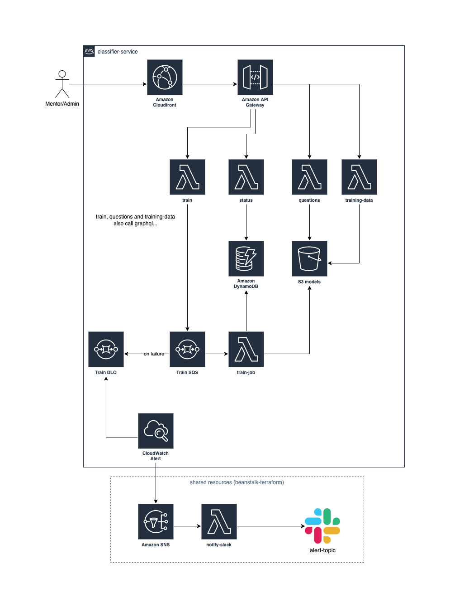

# Intro

This is a serverless service that can train mentors and answer questions:



The code was generated using the `aws-python-docker` template from the [Serverless framework](https://www.serverless.com/).

For detailed instructions, please refer to the [documentation](https://www.serverless.com/framework/docs/providers/aws/).

# Torch

When poetry installs sentence transformers that brings the full torch package (1.7GB). 
I couldn't find a way to easily exclude dependencies https://github.com/python-poetry/poetry/issues/3377
so instead i manually removed torch from poetry.lock file (2d82c26). 

As a better alternative we could take sentence transformers out of poetry
and install them thru pip (see https://github.com/UKPLab/sentence-transformers/issues/1409):

Install order:
- torch CPU
- transformers
- tqdm numpy scikit-learn scipy nltk sentencepiece
- Install sentence transformers without dependencies

## Deployment instructions

There's no cicd pipeline yet, it must be deployed manually (using appropriate credentials)

> **Requirements**: Docker. In order to build images locally and push them to ECR, you need to have Docker installed on your local machine. Please refer to [official documentation](https://docs.docker.com/get-docker/).
> **Requirements**: npm. Run once `npm ci` to get all the tools.

To create the domain name mapping run this command just once:

```
sls create_domain --stage <prod|qa|dev>
``

In order to deploy the service, run the following command:

```
sls deploy -s <stage>
# where stage is one of dev|qa|prod
```

This will build and push a ~2-3GB docker image and can take a while.
Only sqs_train lambda uses docker, so if you want to deploy any other function,
then it's much faster to just deploy one function:

```
sls deploy function -f http_train
```

### Removing all resources

Make sure to first manually empty all the buckets, otherwise the stack cannot be removed, and then:
```
sls remove -s <stage>
```

# Monitoring

All lambdas use sentry to report issues. If processing fails, SQS will move messages to corresponding DLQ,
and there're alarms that monitor DLQs and send message to alerting topic (currently forwards to slack).


# Manual Testing

sls deploy builds a docker image: `<acc>.dkr.ecr.<region>.amazonaws.com/serverless-mentor-classifier-service-<stage>` which can be started and invoked locally:
```
docker run -e SHARED_ROOT=/app/shared -e GRAPHQL_ENDPOINT=https://v2.mentorpal.org/graphql -e API_SECRET=... --rm -p 9000:8080 <image_name>
curl -XPOST "http://localhost:9000/2015-03-31/functions/http_train/invocations" -d '{"mentor":"<id>"}'
```


After successful deployment, you can test the service remotely by using the following command:

```
sls invoke --function http_train -p <event payload>
```

To test the api via api gateway (dev is the stage):

```bash
curl -H "Authorization: Bearer ey***" https://nuj9elv2we.execute-api.us-east-1.amazonaws.com/dev/train --data-raw '{"mentor":"6109d2a86e6fa01e5bf3219f"}'
curl -H "Authorization: Bearer ey***" https://nuj9elv2we.execute-api.us-east-1.amazonaws.com/dev/train/status/5e09da8f-d8cc-4d19-80d8-d94b28741a58
curl -H "Authorization: Bearer ey***" https://nuj9elv2we.execute-api.us-east-1.amazonaws.com/dev/questions?mentor=6109d2a86e6fa01e5bf3219f&query=what+do+you+think+about+serverless
curl -H "Authorization: Bearer ey***" https://nuj9elv2we.execute-api.us-east-1.amazonaws.com/dev/trainingdata/6109d2a86e6fa01e5bf3219f
```
Or against the custom domain name:

```bash
curl -H "Authorization: Bearer ey***" https://api-dev.mentorpal.org/classifier/train --data-raw '{"mentor":"6109d2a86e6fa01e5bf3219f"}'
curl -H "Authorization: Bearer ey***" https://api-dev.mentorpal.org/classifier/train/status/5e09da8f-d8cc-4d19-80d8-d94b28741a58
curl -H "Authorization: Bearer ey***" https://api-dev.mentorpal.org/classifier/questions?mentor=6109d2a86e6fa01e5bf3219f&query=what+do+you+think+about+serverless
curl -H "Authorization: Bearer ey***" https://api-dev.mentorpal.org/classifier/trainingdata/6109d2a86e6fa01e5bf3219f
curl -X POST -H "Authorization: Bearer ey***" https://api-dev.mentorpal.org/classifier/me/followups/category/a335c6df-da3e-4972-b0c3-c822f8144470
```


## Asynchronous triggers

In order to run handlers for asynchronous event triggers locally, e.g. events fired by `SNS` or `SQS`, execute `sls invoke --local -f <function>`. To define a custom event payload, create a `*event.json` file and point to its path with `sls invoke --local -f <function> -p <path_to_event.json>`. Be sure to commit a `.dist` version of it for other developers to be used.

**Example**

```
predict.py -> handler to test
predict-event.json -> your local copy of event.json.dist, which is ignored by git
predict-event.json.dist -> reference event for other developers to be copied and used locally
```

## Debugging

To debug in VS Code, use this config:

```json
{
  "version": "0.2.0",
  "configurations": [
    {
      "name": "Python: Current File",
      "type": "python",
      "request": "launch",
      "program": "${file}",
      "justMyCode": false,
      "env": {
        "GRAPHQL_ENDPOINT": "https://v2.mentorpal.org/graphql",
        "API_SECRET": "<redacted>",
        "AWS_REGION": "us-east-1",
        "SHARED_ROOT": "shared",
        "JOBS_TABLE_NAME": "classifier-jobs-dev",
        "JOBS_SQS_NAME": "classifier-jobs-dev",
        "MODELS_BUCKET": "classifier-models-dev",
      },
      "console": "integratedTerminal"
    }
  ]
}
```

# TODO

- [ ] monitoring & alerting on slow responses
- [ ] train: validate request in api gateway
- [ ] add logging to module.classifier to track execution
- [x] dns name for the api gateway plus base path mapping
- [x] implement full api set
- [x] provisioned concurrency for answer/predict only on prod
- [x] run flake and black
- [x] default gateway response 4xx 5xx
- [x] authentication & authorization
- [x] json logging
- [x] github repo
- [x] architecture diagram
- [x] try to improve answer/predict performance (if-modified-since for models, cache classifiers..)
- [x] cpu-only torch
- [x] remove unused dependencies
- [x] submit feature request for --squash
- [x] remove panda from fetch_training_data and use csv
- [x] separate set of requirements for api lambdas (if they could be made small)
- [x] sentry
- [x] sample events and document how to invoke locally
- [x] api call -> status reporting
- [x] api call -> train job (upload res to s3)
- [x] api call -> answer/predict job (fetch trained model from s3)
- [x] jobs table ttl so we dont need to clean it up manually
- [x] monitoring & alerting (sqs dlq sends to slack, lambda to sentry)
- [x] infrastructure code
- [x] api gateway
- [x] LFS for /shared
- [x] CORS headers
- [x] secure headers


# Resources

 - https://www.serverless.com/guides/aws-http-apis
 - https://www.serverless.com/framework/docs/providers/aws/guide/serverless.yml
 - https://www.serverless.com/framework/docs/providers/aws/events/apigateway
 - https://www.serverless.com/blog/container-support-for-lambda
 - https://dev.to/aws-builders/container-images-for-aws-lambda-with-python-286c
